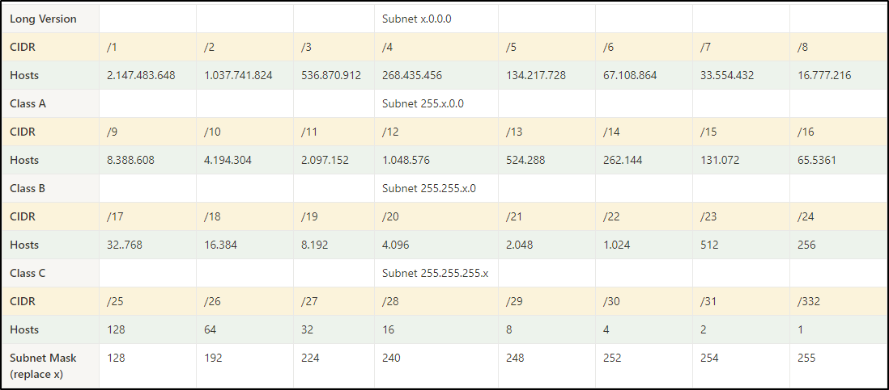

>CIDR = Classless Inter-Domain Routing

- Hosts double each increment of a CIDR
- Always subtract 2 from host total
    - Network ID: First address
    - Broadcast: Last address

![[Pasted image 20230708123102.png]]

Calculate Subnet mask:
- add previous subnet mask and current number of hosts
    - 128 + 64 = 192
    - 192 + 32 = 224
    - 244 + 16 = 240
    - ...

[[Common Network commands]]