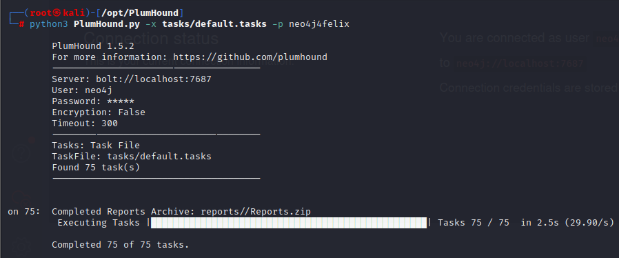

# Plumhound

## Usage

- Open the [Neo4j Console](C:\Users\felix\Documents\Notes\ADDS\Enumeration\Neo4j)
- collect Data via Bloodhound and import it into the Database

### Run Plumhound

```bash
python3 plumhound.py -x tasks/default.tasks -p password
```

-x = execute task
-p = Password

## Output
