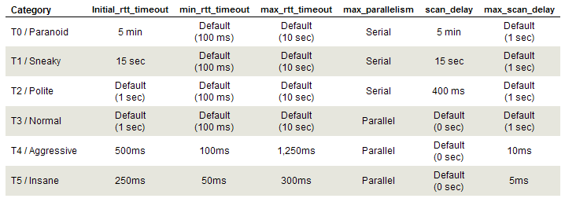

# Scanning with Nmap

## Basic scans
```bash
nmap -sn
```
```python
-sn # ping scan
-Pn # port scan
-O # OS Detection
-sV # Service version detection
-sS # TCP SYN Scan/Stealth scan(no connection is being established, just asking if port is open and the leaving)
-sU # Scan UPD Ports
-sC # Default scripts
```

## Inverse TCP Flag scanning
- no answer = PORT OPEN
- answer = PORT CLOSED

### [INF] **Does not work on windows**

### Xmas Scan
- combines FIN, URGE and PUSH Flags
```bash
nmap -sX <ip>
```
### FIN Scan
```bash
nmap -sF <ip>
```
### NULL Scan
- not sending any flags
```bash
nmap -sN <ip>
```


```bash
nmap -sN <ip>
```

## Firewall detection
- ACK probing
```bash
nmap -sA 192.168.0.1
```
- sendind ACK packages if RST answer -> no firewall

## Firewall evasion
### Decoys  
- nmap will add fake connections from decoy addresses to obfuscate the traffic orignating from your IP
```bash
nmap -D (RND:<amount>/specific IP)
```
### Fragmentation
- fragments packets into lowest size possible
```bash
nmap -f <ip>
```
### MTU (Minumum Transmission Unit)
- allows fragmentation to custom size(8*x)
```bash
nmap --mtu 16 <ip>
```
### SLow scanning
- T1 = sneaky scan with much delay between request
```bash
nmap -T1 <ip>
```
### little parallelisms
```bash
nmap --max-parallelism 1 <ip>
```
### IP Address Spoofing
```bash
nmap -S <fakeIp> <target IP>

```
### Use specific port
- great if default nmap port is getting blocked
```bash
nmap -g <port> <ip>
```
    

## Scan timing and performance
### Timing Templates
- range from T0(slowest) -> T5(fastest)

### Parallism
- used to specify the amount of parallel scanning processes
- the more parralel operations the faster the scan
- the more parralel operations the less accurate the results
```bash
nmap --min-parallelism 10 <ip>
```

## Output
```bash
nmap -oA <ip>
```
- outputs results on three major formats: XML, Normal, s|<rIpt kIddi3

# Nmap Script engine (NSE)
- allows users to write their own scripts to automate scanning
- scripts are written in "lua" and are .nse files
- default scripts are stored in '/usr/share/nmap/scripts'
### Basic Syntax
```bash
nmap --script=<script-name> <ip>
# .nse extensions will automatically be added so no need to type it out
```

### Advanced commands
```bash
nmap --script-updatedb
# updates script database
```
- Scan for anonymous FTP auth
```bash
nmap -p21 --script=ftp-anon <ip>
# always good to specify the port when running port specific scripts
```
- run multiple scripts at the same time
```bash
nmap --script=<script1>,<script2>,<script3>,...
nmap -p21 --script=ftp-vsftpd-backdoor 192.168.70.151
# intrusive script -> enganges with target and exectues commands and exploits!
```
- run all scripts related to a service e.g. ftp
```bash
nmap -p21 --script="ftp-*" 192.168.70.151
# will use every script with "ftp-" in the filename
# NSE is very noisy on systems so use firewall evasion properly
```