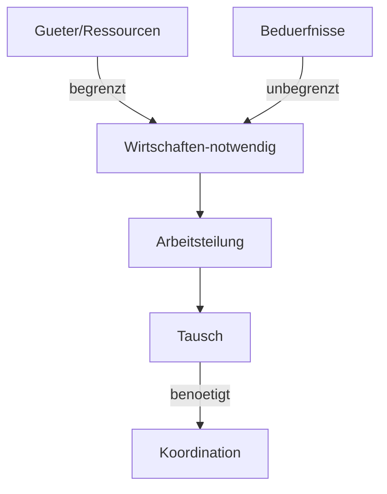

```mermaid
graph TD;
    Gueter/Ressourcen -- begrenzt --> Wirtschaften-notwendig;
    Beduerfnisse -- unbegrenzt --> Wirtschaften-notwendig;
    Wirtschaften-notwendig --> Arbeitsteilung;
    Arbeitsteilung --> Tausch;
    Tausch -- benoetigt --> Koordination;
```

### > **Wer** produziert **was**, **wie**, fuer **wen**?